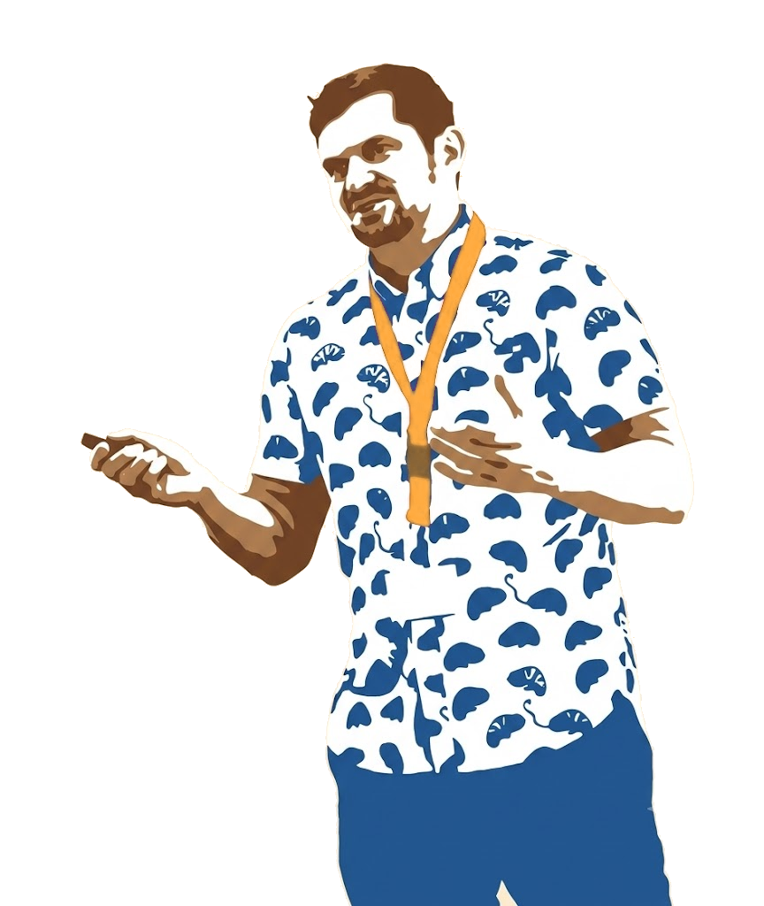

::: {.about-lede}

::: {.about-figure}
{fig-alt="Illustration of Adam Hardaker speaking at an event"}
:::

::: {.about-copy}
I am a doctoral researcher at the University of Kassel's [International Center for Higher Education Research (INCHER)](https://www.uni-kassel.de/forschung/en/incher/), where I study researcher mobility and metascience.

My work combines data engineering, econometrics, and machine learning. Much of it involves building large-scale pipelines that link dissertations, publication databases, and institutional records across Europe. I also look at how our understanding of the knowledge frontier via meta-analyses is shaped by which evidence can be replicated.

Before academia, I spent eight years as a U.S. Army aviation officer and Blackhawk pilot. Later, I worked doing business development for a cryptocurrency foundation, before realizing that I missed academia.

Outside research, can be found hanging out with my family, reading, playing music, or administrating [Rugby Cassel](https://rugbycassel.de/) as club president.
:::

:::
