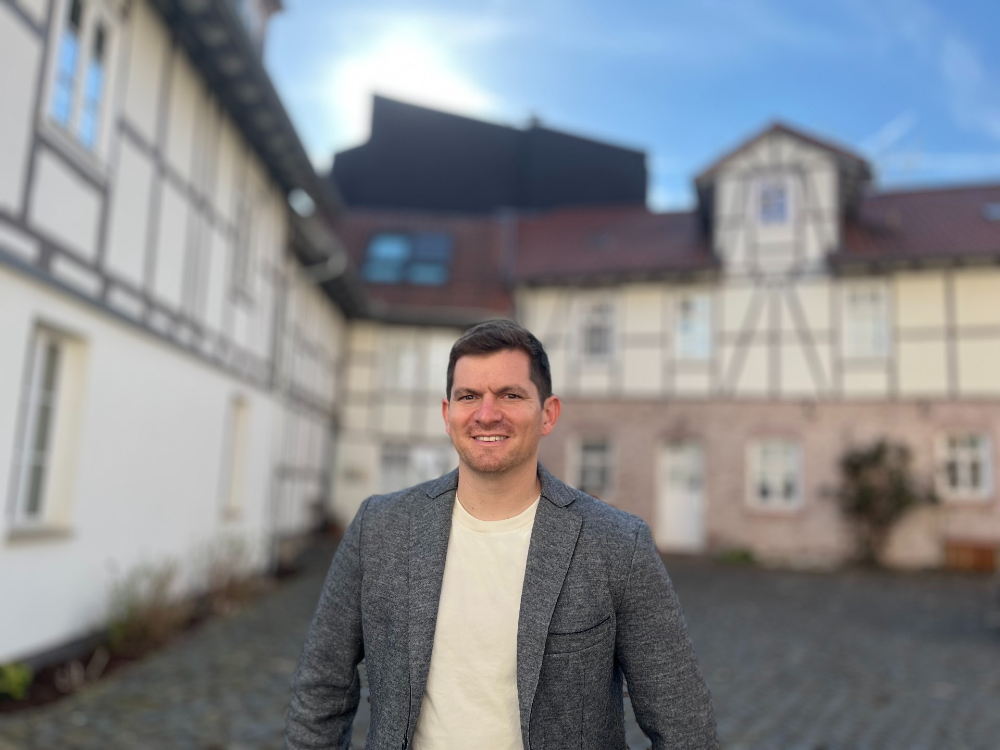

::: {.site-shell}

::: {.hero-panel}

::: {.hero-copy}

::: {.tape-label}
Economics + machine learning + higher education
:::

::: {.hero-name}
# Adam Hardaker
:::

I am a doctoral researcher at [INCHER, University of Kassel](https://www.uni-kassel.de/forschung/en/incher/), studying academic mobility, research careers, and the systems that shape higher education. I build data pipelines, use econometrics and machine learning, and try to make the messy parts of science legible.

::: {.hero-actions}
[Research](research.qmd){.button .primary-button}
[Side Quests](side-quests/index.qmd){.button .secondary-button}
[CV](cv.qmd){.button .secondary-button}
[ Email](mailto:adam.hardaker@uni-kassel.de){.button .secondary-button aria-label="Email"}
:::

:::

::: {.hero-photo}
{fig-alt="Portrait of Adam Hardaker"}

::: {.social-strip}
[](https://www.linkedin.com/in/michael-adam-hardaker/){aria-label="LinkedIn"}
[](https://substack.com/@ahardaker){aria-label="Substack"}
[](https://orcid.org/0009-0008-1200-0127){aria-label="ORCID"}
[](https://github.com/TalkToMeGoose){aria-label="GitHub"}
:::
:::

:::

::: {.quick-grid}

::: {.sketch-card}
### What I work on

- Causal machine learning
- Higher education and research careers
- Publication bias and meta-research
- Large linked administrative and bibliometric datasets
:::

::: {.sketch-card .accent-card}
### New paper

**No evidence that non-incentivized behavioral interventions effectively mitigate climate change after adjusting for publication bias**  
PNAS Nexus, 2026

[Read the paper](https://doi.org/10.1093/pnasnexus/pgag150){.small-link}
:::

::: {.sketch-card}
### Side quest

{.project-snapshot fig-alt="Screenshot of MeetSpace showing the events board interface"}

[MeetSpace](https://www.meet-space.com/) is a lightweight campus events board I built for student discovery, organization posts, and practical local coordination. I also help run [Rugby Cassel](https://rugbycassel.de/) as club president and built the club website.

[See side projects](side-quests/index.qmd){.small-link}
:::

:::

::: {.section-band}

## Upcoming Talks

::: {.work-list}

::: {.work-item}
**[DRUID26 Conference](https://conference.druid.dk/Druid/?confId=72)**  
Copenhagen Business School, Denmark | June 8-10, 2026  
*Paper Presentation - National and Transnational Embeddedness in Early-Career Researcher Mobility: Evidence from German Doctoral Graduates*
:::

:::

:::

::: {.section-band}

## Selected Work

::: {.work-list}

::: {.work-item}
**Climate behavior interventions and publication bias**  
Reanalysis of 144 effect estimates from 91 studies using Robust Bayesian Meta-Analysis. The published evidence strongly favors a zero average effect after accounting for publication bias and model uncertainty.

[PNAS Nexus](https://doi.org/10.1093/pnasnexus/pgag150) | [Code and materials](https://osf.io/fcjbe/)
:::

::: {.work-item}
**Academic mobility and research careers**  
Doctoral work at INCHER linking dissertations, publications, and institutional records to study movement through higher education systems.
:::

::: {.work-item}
**MeetSpace**  
A React, Vite, Tailwind, and Supabase campus events app with playful bulletin-board styling, filtering, reporting, profiles, and organization workflows.

[meet-space.com](https://www.meet-space.com/) | [GitHub](https://github.com/TalkToMeGoose/MeetSpace)
:::

:::

:::

::: {.section-band}

::: {}
## A Bit More Human

Before academia, I spent eight years as a U.S. Army aviation officer and Blackhawk pilot, followed by a transition into business development. I've found that the leadership and operational focus from the military, combined with the strategic mindset of business development, translates surprisingly well to managing complex data projects and research pipelines. These days I split time between research, programming, Rugby Cassel admin, and the occasional side project that starts as "this should exist" and becomes a repo.
:::

:::

:::
