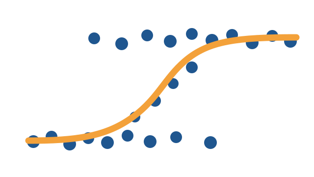

::: {.page-lede .research-lede}
My main research areas are **researcher mobility** and **metascience**. For this I typically use bibilmetric dataset like SCOPUS, OpenAlex, etc., and replications of primary studies.

{.research-lede__mark fig-alt="Binary observations and a fitted logistic regression curve"}
:::

## Publications

::: {.publication-list}

:::
