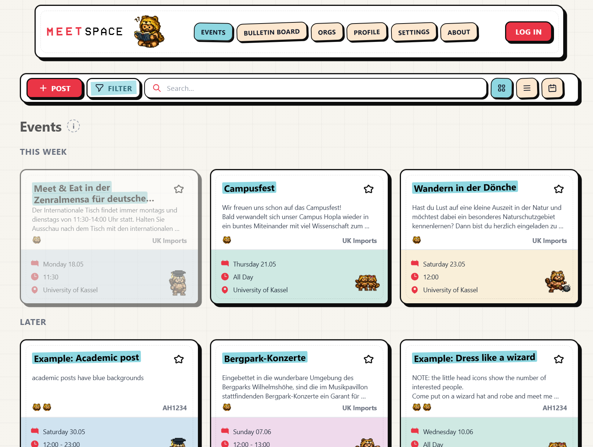

[MeetSpace](https://www.meet-space.com/) is a lightweight campus events board built with React, Vite, Tailwind, and Supabase. It supports student and organization posts, filtering, bookmarks, reporting, admin review, and profile tools.

{.project-snapshot .wide-snapshot fig-alt="Screenshot of MeetSpace showing campus event cards"}

The visual style is deliberately more playful than this site: grid paper, sticker shadows, tape labels, and hand-drawn card treatment.

[Visit MeetSpace](https://www.meet-space.com/) | [Intro video](https://www.youtube.com/watch?v=Mr4Pe7pxijI) | [GitHub](https://github.com/TalkToMeGoose/MeetSpace)
